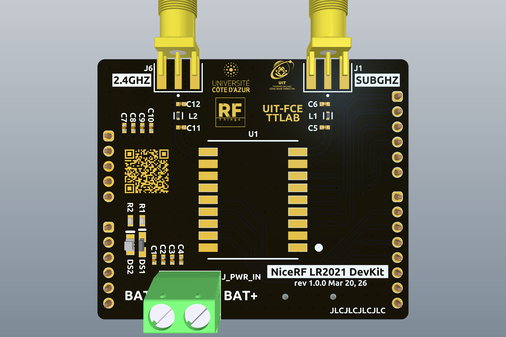
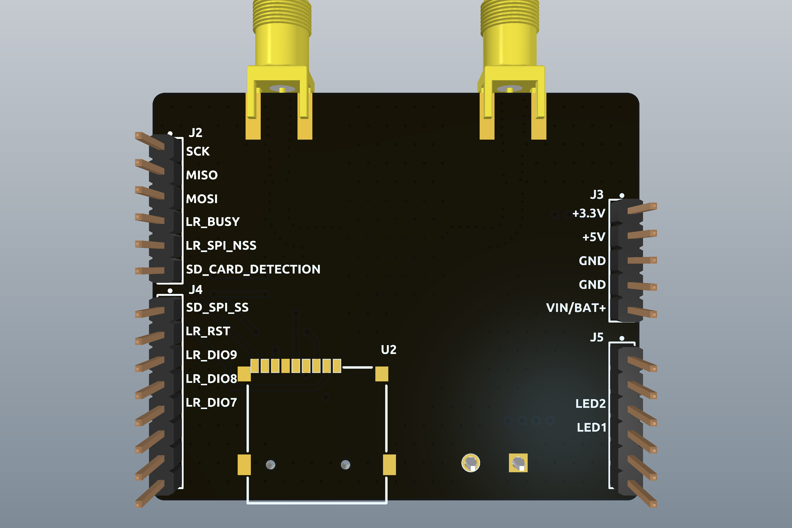

# 🛰️ NiceRF LR2021 DevKit

This repository contains the full PCB design files for the **NiceRF LR2021 Development Kit**, a compact evaluation platform for LoRa-based wireless communication.

## 🛠 Key Features

| Component | Specification |
| :--- | :--- |
| **LoRa Module** | [NiceRF LoRa2021](https://www.nicerf.com/lora-module/lora2021.html) |
| **Storage** | MicroSD Card Slot (SPI) |
| **Indication** | 2x Programmable LEDs |
| **Form Factor** | Breadboard friendly / DevKit style |

# Top View

# Bottom View

---
